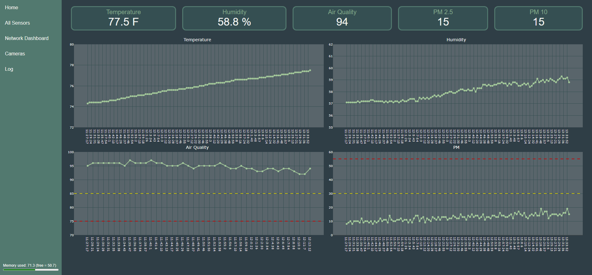

# ESP32AirQuality

This project is a MicroPython-based sensor monitoring and alert system that collects data from various sensors and provides real-time monitoring through a web interface. The system runs on an ESP32 and is designed to monitor sensor readings such as temperature, humidity, pressure, gas resistance, and particulate matter (PM) levels. It also includes functionality to monitor the status of doors and send alerts via Telegram if certain conditions are met.

<p align="center"></p>


## Features
- Collects data from sensors including BME680 (temperature, humidity, pressure, gas resistance) and PMS5003 (particulate matter).
- Monitors the status of doors and sends alerts if they are left open for too long.
- Sends Telegram alerts if PM levels or air quality drop below certain thresholds.
- Provides a web interface for real-time monitoring of sensor readings.
- Sends data to InfluxDB for long term data storage.
- Includes a clock synchronization feature to set the real-time clock (RTC) of the system.

## Hardware Requirements
To run this project, you will need the following hardware components:
- ESP32 microcontroller board
- BME680 sensor module
- PMS5003 sensor module
- Door magnetic reed switches ([such as these](https://www.amazon.com/Surface-Mounted-Magnetic-Contacts-Window/dp/B085CMPW5R))

## Software Requirements
The project requires the following software dependencies:
- MicroPython (custom firmware, in "firmware" folder, includes the following modules frozen in it)
    - [Microdot](https://github.com/miguelgrinberg/microdot)
    - [bme680](https://github.com/adafruit/Adafruit_CircuitPython_BME680)
    - [bme680AQ](https://github.com/thstielow/raspi-bme680-iaq)
    - [pms5003](https://github.com/kevinkk525/pms5003_micropython)
    - [ulogger](https://github.com/whales-chen/micropython-ulogger) (some changes were made)
    - aqUtils (custom functions)
- IDE such as [Thonny](https://thonny.org/) to flash files to ESP32.  

## Installation
1. Connect the sensors to the ESP32 according to the table below:  
    | Sensor | Sensor Pin | ESP32 Pin|
    | --- | --- | --- |
    | BME680 | Vin | 3.3V |
    | BME680 | GND | GND |
    | BME680 | SCL | GPIO 27 |
    | BME680 | SDA | GPIO 26 |
    | PMS5003 | Vcc | 5V |
    | PMS5003 | GND | GND |
    | PMS5003 | RXD | GPIO 14 |
    | PMS5003 | TXD | GPIO 25 |
    | PMS5003 | RESET | GPIO 13 |
    | Door Sensors | 1 | GND |
    | Door Sensors | 2 | Any open GPIO (needs to be set in `main.py` for your specific use case) |  
    
    If you would like to control a garage door opener you will need to figure out the hardware integration on your own.

1. Clone the project repository from GitHub:  
    ```
    git clone https://github.com/hemingerg1/ESP32AirQuality.git
    ```
1. Fill in your information in `secrets.py` file.

1. Customize door switch information in `main.py`, `static/html/sensors.html`, `static/js/sensors.js` for your use case.

1. Modify IP address in `static/html/cam.html` if you have cameras you want to include.

1. Modify IP address in `static/html/dash.html` if you have a dashboard you want to include.

1. Flash firmware to ESP32.

1. Flash `main.py`, `boot.py`, `secrets.py`, and the entire `static` directory to the ESP32.

1. Reset the ESP32

1. Access the web interface by navigating to `http://<ESP32-IP-Address>` in a web browser.

## Usage
Once the program is running and the web interface is accessible, you can monitor the sensor readings and door statuses in real-time. The web interface provides different pages for viewing sensor data, system logs, and camera feeds (if available).  

You can also set the real-time clock (RTC) of the system through the web interface by navigating to the "Log" page then "Change Clock" button.  

If AQ or PM sensor readings exceed the defined thresholds or if doors are left open for too long, the system will send alerts via Telegram. Make sure to configure the Telegram integration settings in the code before running the program.

<details>
<summary> Contributing</summary>  
Contributions to this project are welcome. If you find any issues or have suggestions for improvements, please open an issue or submit a pull request on the GitHub repository.
</details>

<details>
<summary> License </summary>
This project is licensed under the GNU General Public License. Feel free to use, modify, and distribute the code for personal or commercial purposes.
</details>

<details>
<summary>Acknowledgements</summary>
This project was inspired by the need for a reliable and customizable sensor monitoring and alert system. Special thanks to the developers of the libraries and frameworks used in this project for their contributions to the open-source community.
</details>
